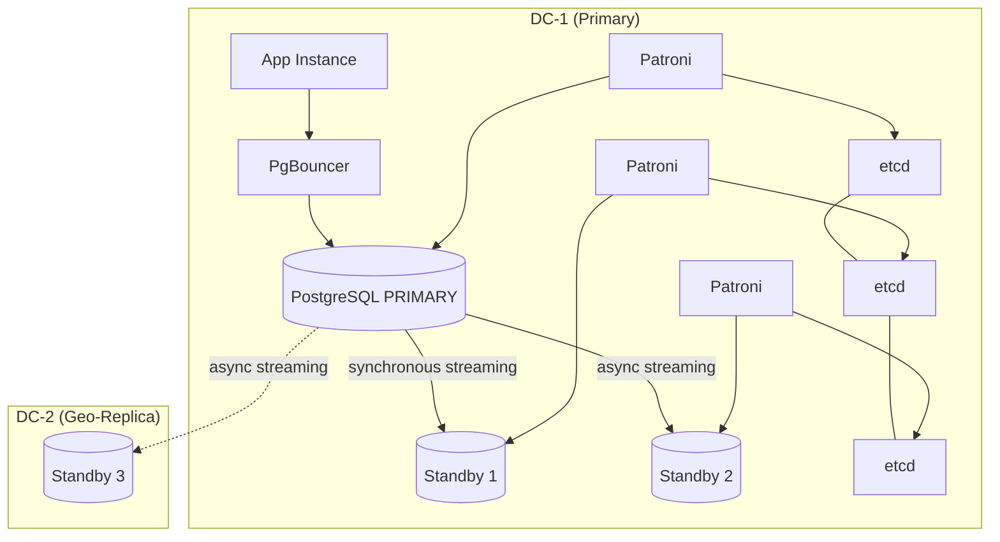

# ADR-0003: PostgreSQL Replication Strategy — Patroni with Synchronous Streaming Replication

## Status
Proposed

## Date
2026-07-15

## Context
Nexus is a multi-tenant SaaS platform with a hard requirement: **no data loss on primary failure**. PostgreSQL 16 is the core database. In development, a single PostgreSQL container suffices. For production, we need:

- Automatic failover (RTO < 15 min per DR requirement)
- Zero data loss on failover (RPO = 0 for committed transactions)
- Multi-location geo-redundancy
- Compatibility with our Docker Compose dev workflow AND a future production orchestrator
- Connection pooling to handle hundreds of tenant-scoped connections

### Constraints
- Team size is small; solution must be operable by 1–2 DevOps-aware engineers
- No committed cloud provider yet — solution must be portable across VPS, bare metal, or cloud VMs
- Multi-tenant isolation must survive failover (no cross-tenant data exposure)

## Decision

### Primary: Patroni + etcd + PgBouncer

| Component | Role |
|-----------|------|
| **Patroni** | PostgreSQL HA orchestrator — manages leader election, failover, and replication configuration |
| **etcd** (3-node cluster) | Distributed consensus store for Patroni leader election |
| **PgBouncer** | Connection pooler in transaction mode, sits between application and PostgreSQL |
| **PostgreSQL 16** | Streaming replication: synchronous to 1 standby (same DC), asynchronous to geo-replicas |

### Topology

### Replication Mode
- **1 synchronous standby** in the same DC: `synchronous_commit = remote_write`, `synchronous_standby_names = '1 (standby1)'`
- **2+ asynchronous standbys**: one in same DC for read scaling, one geo-redundant in DC-2
- This guarantees RPO = 0 for any single-node failure in DC-1

### Production Orchestration
- **Phase 1 (MVP)**: Patroni + etcd + PostgreSQL on dedicated VPS instances managed via systemd + Ansible
- **Phase 2 (scale)**: Migrate to **k3s** (lightweight Kubernetes). Patroni runs as a StatefulSet with anti-affinity rules; etcd runs as a separate 3-node StatefulSet; PgBouncer runs as a Deployment with HPA
- Docker Compose remains dev-only; a `docker-compose.ha.yml` can simulate Patroni locally for testing

## Rationale

### Why Patroni over alternatives?

| Alternative | Rejected Because |
|-------------|-----------------|
| **pgAutoFailover** | Simpler but less mature ecosystem; no built-in synchronous replication enforcement; smaller community than Patroni |
| **Stolon** | Archived/abandoned project; no longer actively maintained |
| **AWS RDS Multi-AZ** | Vendor lock-in; cannot deploy on VPS/bare metal; higher monthly cost at scale; less control over replication lag tuning |
| **GCP Cloud SQL HA** | Same lock-in concern; Nexus is not committed to GCP |
| **Managed PostgreSQL (Crunchy/EDB)** | Excellent but expensive; better evaluated post-MVP when operational budget is clearer |
| **Repmgr** | Manual failover by default; auto-failover requires external scripting; less robust than Patroni's etcd-backed consensus |

### Why etcd over Consul/ZooKeeper?
- etcd is the standard for Patroni; Kubernetes uses it too, so skills transfer
- 3-node cluster is sufficient for our scale
- Lower resource footprint than Consul

### Why PgBouncer over pgpool-II?
- PgBouncer is dramatically lighter (< 10 MB RAM vs 100s of MB)
- Transaction pooling mode is ideal for HTTP request/response patterns
- Simpler configuration, fewer gotchas
- Industry standard alongside Patroni (GitLab, Zalando, etc.)

### Synchronous Replication Trade-off
- **Cost**: synchronous replication adds ~2–5ms latency per write (network round-trip to standby). This is acceptable for business SaaS workloads (not real-time trading).
- **Mitigation**: `synchronous_commit = remote_write` (ack on standby WAL write, not fsync) reduces latency while still guaranteeing no data loss if primary crashes.

## Consequences

### Positive
- Zero data loss on primary failure (RPO = 0 for committed writes)
- Automatic failover within 30–60 seconds (well within RTO < 15 min)
- Portable: runs on any Linux VPS, no cloud lock-in
- Connection pooling solves the multi-tenant connection explosion problem
- PgBouncer can be reconfigured to route reads to standby replicas if read scaling is needed later

### Negative
- Operational complexity: team must manage Patroni + etcd + PgBouncer (3 additional services)
- Synchronous standby in same DC means if BOTH DC-1 nodes fail simultaneously, data loss is possible (mitigated by geo-replica + backups)
- etcd split-brain risk requires careful network configuration (3 nodes, odd count, proper fencing)
- Monitoring must cover: replication lag, Patroni health, etcd quorum, PgBouncer pool saturation

### Mitigations Required
- Prometheus alerts for: `pg_stat_replication` lag > 1s, Patroni `pause` state, etcd leader changes
- Monthly failover drills (planned switchover via `patronictl switchover`)
- PgBouncer `server_idle_timeout` tuned to prevent idle connections holding memory

## Alternatives Considered

| Alternative | Rejected Because |
|-------------|-----------------|
| AWS RDS Multi-AZ | Vendor lock-in; cannot deploy on VPS/bare metal |
| pgAutoFailover | Less mature; weaker synchronous replication guarantees |
| Stolon | Project archived |
| Repmgr + keepalived | Manual failover by default; fragile auto-failover scripts |
| Logical replication | Cannot replicate DDL; lag-prone for HA; better suited for partial data sync |

## References
- Redmine issue: #502
- Related ADRs: ADR-0004 (backup strategy), ADR-0005 (file storage HA)
- External docs:
  - [Patroni documentation](https://patroni.readthedocs.io/)
  - [PgBouncer configuration](https://www.pgbouncer.org/config.html)
  - [PostgreSQL synchronous replication](https://www.postgresql.org/docs/16/warm-standby.html#SYNCHRONOUS-REPLICATION)
