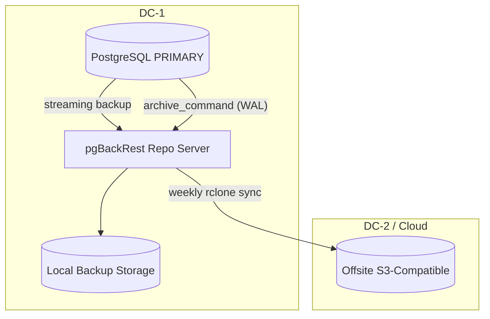

# ADR-0004: Backup Strategy — pgBackRest with WAL Archiving and Offsite Rotation

## Status
Proposed

## Date
2026-07-15

## Context
ADR-0003 defines a Patroni-based PostgreSQL HA cluster with synchronous replication. Replication protects against hardware failure but does NOT protect against:

- Accidental `DROP TABLE` or `DELETE FROM ... WHERE` mistakes
- Ransomware or malicious data destruction
- Correlated failures (power outage affecting entire DC)
- Application-level data corruption that replicates to standbys

We need a backup strategy that provides **point-in-time recovery (PITR)** with RPO < 5 minutes and supports restoration to any point within the retention window.

### Requirements
- Daily full backups, retained 30 days
- Continuous WAL archiving (RPO < 5 min means WAL must ship every 1–2 minutes)
- Weekly offsite backups (different geographic region from primary DC)
- Restoration tested monthly (automated restore + smoke test)
- Encrypted at rest (backup files contain multi-tenant data)
- Must not impact primary database performance during backup window

## Decision

### Primary: pgBackRest

| Aspect | Choice |
|--------|--------|
| **Backup tool** | pgBackRest |
| **Full backup** | Daily at 02:00 UTC (off-peak) |
| **Differential backup** | Every 6 hours (08:00, 14:00, 20:00) |
| **WAL archiving** | Continuous, shipped every 60 seconds via `archive_command` |
| **Retention** | 30 days full + differential, WAL retained for the full backup window |
| **Offsite** | Weekly full backup synced to S3-compatible storage (Backblaze B2 / Cloudflare R2 / AWS S3) |
| **Encryption** | `repo1-cipher-type=aes-256-cbc` at rest |
| **Compression** | `compress-type=zst` (best speed/size trade-off) |
| **Restore testing** | Monthly automated restore to ephemeral instance with schema + data smoke test |

### Backup Architecture



### pgBackRest Stanza Configuration
```ini
[nexus]
pg1-path=/var/lib/postgresql/16/main
pg1-port=5432

[global]
repo1-path=/backup/pgbackrest
repo1-retention-full=30
repo1-retention-diff=8
repo1-cipher-type=aes-256-cbc
compress-type=zst
compress-level=3
process-max=4
log-level-console=info
archive-async=y
spool-path=/var/spool/pgbackrest

# Offsite repo (S3-compatible, via rclone mount or pgBackRest S3 support)
repo2-path=/mnt/offsite-backup
repo2-retention-full=4
repo2-cipher-type=aes-256-cbc
repo2-s3-bucket=nexus-offsite-backups
repo2-s3-endpoint=s3.eu-west-1.amazonaws.com
repo2-s3-region=eu-west-1
```

## Rationale

### Why pgBackRest over alternatives?

| Alternative | Rejected Because |
|-------------|-----------------|
| **WAL-G** | Simpler and cloud-native, but lacks built-in differential backups (full only); no parallel restore; weaker retention policy management; smaller ecosystem |
| **Barman** | 2ndQuadrant/EDB tool; good but heavier (Python-based agent); less active community than pgBackRest; tighter EDB ecosystem coupling |
| **pg_dump** | Logical backup only; no PITR; inconsistent at scale; slow restore for large databases |
| **Filesystem snapshots (ZFS/LVM)** | Fast but requires filesystem-level integration; no built-in WAL management; harder to do partial restores (single DB/table) |

### Why pgBackRest specifically:
1. **Parallel backup & restore**: Uses multiple processes; critical for large databases
2. **Differential backups**: Only changed pages since last full — faster than nightly fulls, smaller storage
3. **Built-in PITR**: Point-in-time recovery is a first-class feature, not bolted on
4. **S3 support**: Can write directly to S3-compatible storage (no rclone needed for offsite)
5. **Delta restore**: Restores only changed blocks — dramatically faster restores for partial corruption
6. **Battle-tested**: Used by Crunchy Data, EDB, and many large PostgreSQL deployments

### Retention Strategy Rationale
- **30 days full**: Covers month-end reporting reconciliation needs
- **Differential every 6 hours**: Restore granularity of 6 hours without replaying a full day of WAL
- **WAL continuous**: 60-second ship interval gives RPO < 1 minute (beats the < 5 min requirement)
- **Weekly offsite**: 4 offsite full backups retained; protects against DC-level disaster

### Cost Estimate

| Storage Tier | Monthly Volume (est.) | Provider | Monthly Cost |
|-------------|----------------------|----------|-------------|
| Local backup (30d full + diff) | ~500 GB | VPS-attached volume | ~$25 |
| Offsite (4 weekly fulls) | ~200 GB | Backblaze B2 | ~$1.20 |
| **Total** | **~700 GB** | | **~$26.20** |

Assumes 10 GB database growing to 50 GB over first year.

## Consequences

### Positive
- RPO < 1 minute (WAL ships every 60 seconds)
- Point-in-time recovery to any second within retention window
- Parallel restore minimizes downtime during recovery
- Encrypted at rest — no plaintext multi-tenant data in backups
- S3-compatible offsite means no single-DC failure can destroy all backups
- Monthly restore tests ensure backups actually work

### Negative
- pgBackRest adds operational complexity (another service to monitor)
- Backup storage cost grows linearly with database size
- Restore time depends on database size (large DB = longer RTO)
- Offsite restore from cloud storage is bandwidth-limited (~100–500 Mbps typical)
- AES-256 encryption means key management is critical (lose the key, lose the backups)

### Mitigations Required
- Prometheus alert if `pgbackrest --stanza=nexus check` fails
- Prometheus alert if WAL archive lag > 5 minutes
- Encryption keys stored in HashiCorp Vault or Ansible Vault (not in repo)
- Monthly restore drill documented and scheduled as recurring Redmine task
- Bandwidth test to offsite provider before relying on it for DR

## Validation Plan

| Test | Expected Result |
|------|----------------|
| **Restore full backup** (pgBackRest restore latest) | Database restored and healthy; **recovery time < 15 min** |
| **Point-in-time recovery** (restore to specific timestamp) | Database recovered to exact requested timestamp; data after that point is gone |
| **Verify backup integrity** (`pgbackrest check` on latest backup) | All WAL segments present; no corruption detected; checksums pass |
| **Offsite sync** (check Backblaze B2 bucket after nightly sync) | Latest backup files present in B2; **sync completed within 24h** of local backup |
| **Restore from offsite** (pgBackRest restore from B2 repo) | Full recovery possible using only offsite backups; same RTO as local restore |
| **WAL archiving** (check archive after 100 transactions) | All WAL segments archived within 60 seconds of generation |

If any test fails, this ADR must be reconsidered.

| Alternative | Rejected Because |
|-------------|-----------------|
| WAL-G | No differential backups; less mature retention management |
| Barman | Heavier agent; smaller community; EDB ecosystem coupling |
| pg_dump only | No PITR; slow restore |
| Filesystem snapshots | No built-in WAL management; harder partial restore |

## References
- Redmine issue: #502
- Related ADRs: ADR-0003 (replication strategy), ADR-0005 (file storage HA)
- External docs:
  - [pgBackRest User Guide](https://pgbackrest.org/user-guide.html)
  - [pgBackRest S3 Storage](https://pgbackrest.org/configuration.html#section-repository/option-repo-s3-bucket)
